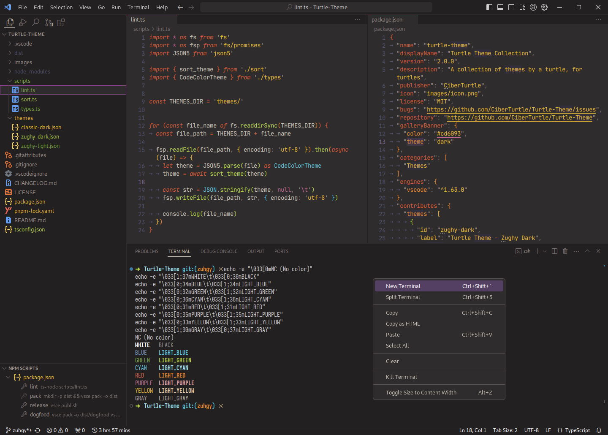
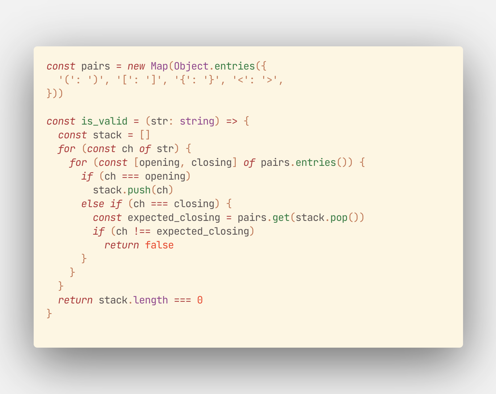
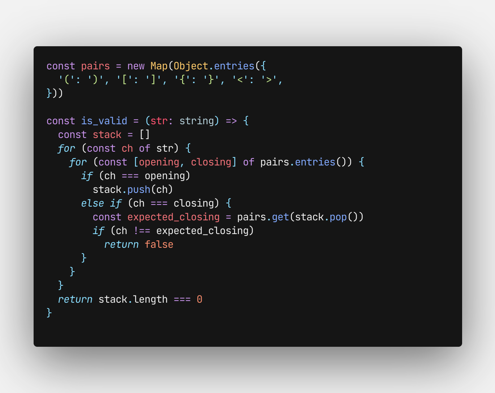
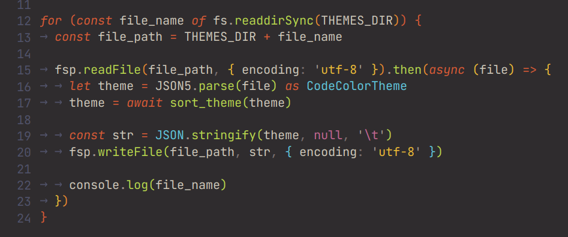

_**“A collection of themes by a turtle, for turtles.”**_

> Also check out my other extension: [Sharp Icons](https://marketplace.visualstudio.com/items?itemName=CiberTurtle.sharp-icons)!

## The Themes in this Collection

### Zughy Dark

> The primary theme of the collection.

### Zughy Light

> Great for on the go coding where screen glare can become a serious problem!

### Classic

> Note: Classic theme is no longer maintained. It's the original theme but looked too ugly to be updated.

## Consistent Syntax Color!

- Variables are white
- Keywords are red
- Functions are green
- Types are blue
- Strings are yellow
- Number-likes and character escapes are purple

## Credits

### Zughy
- [Zughy 32](https://lospec.com/palette-list/zughy-32) for the color palette.

### Classic
- [Community Material Theme (deprecated)](https://marketplace.visualstudio.com/items?itemName=Equinusocio.vsc-community-material-theme)
  for the syntax highlighting colors.
- [Monokai Pro](https://monokai.pro) for terminal colors.
