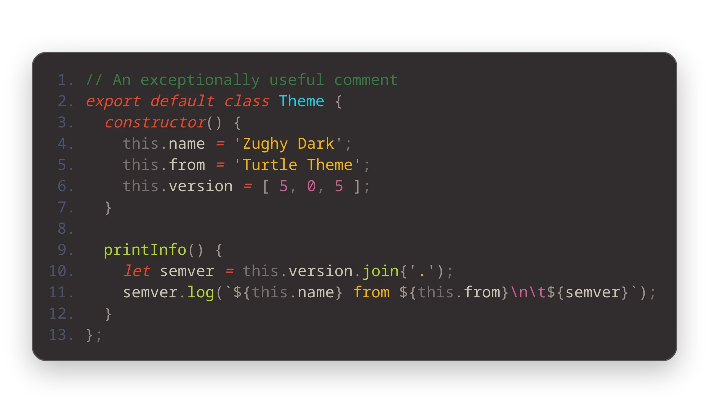
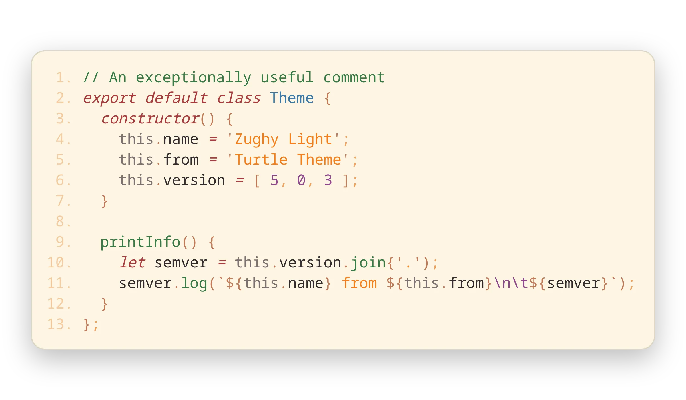
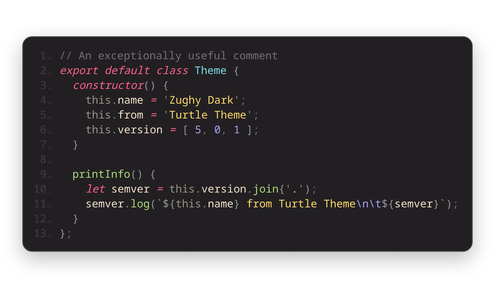
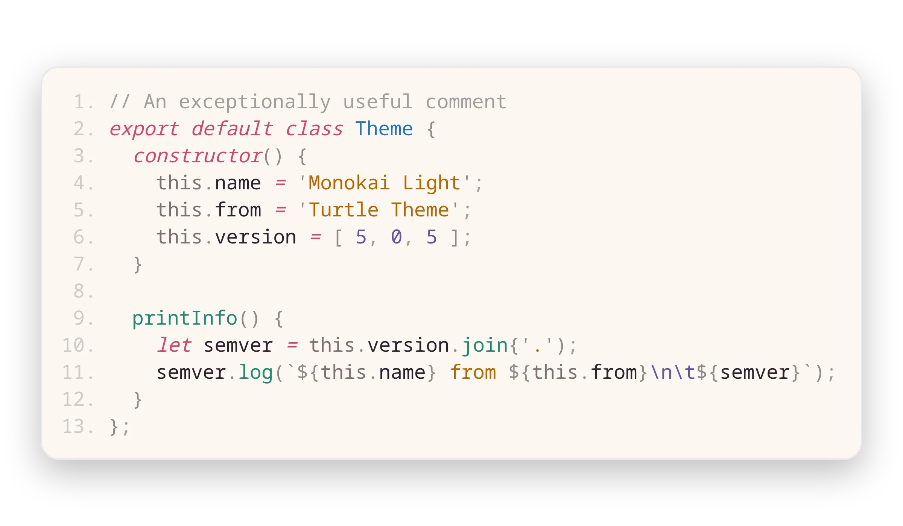

_**“A collection of themes by a turtle, for turtles.”**_

> Also check out my other extension: [Sharp Icons](https://marketplace.visualstudio.com/items?itemName=CiberTurtle.sharp-icons)!

## The Themes in this Collection

### Zughy Dark

### Zughy Light

### Monokai Dark

### Monokai Light

## Consistent Syntax Color!

- Variables are white
- Keywords are red
- Functions are green
- Types are blue
- Strings are yellow
- Number-likes and character escapes are purple

## Credits

- [Monokai Pro](https://monokai.pro) for Monokai theme colors.
- [Zughy 32](https://lospec.com/palette-list/zughy-32) for the color palette.
